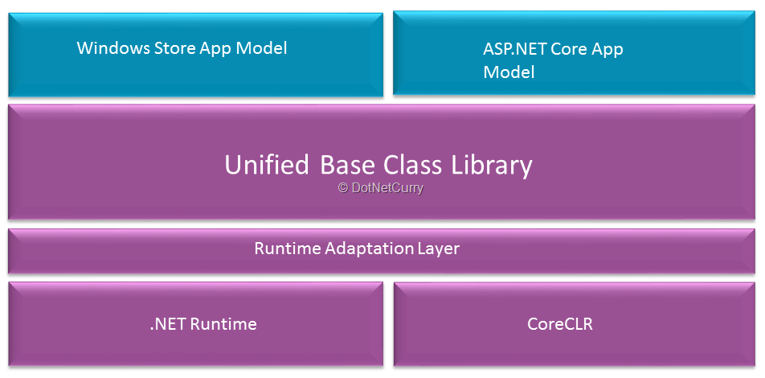

## Introduction to .NET Core

.NET Core is an open-source, general-purpose development platform maintained by Microsoft and the .NET community on GitHub. It's cross-platform (supporting Windows, macOS, and Linux) and can be used to build device, cloud, and IoT applications. 

.NET Core has the following characteristics:
- Cross-platform: Runs on Windows, macOS, and Linux operating systems.
- Consistent across architectures: Runs your code with the same behavior on multiple architectures, including x64, x86, and ARM.
- Command-line tools: Includes easy-to-use command-line tools that can be used for local development and in continuous-integration scenarios.
- Flexible deployment: Can be included in your app or installed side-by-side (user-wide or system-wide installations). Can be used with Docker containers.
- Compatible: .NET Core is compatible with .NET Framework, Xamarin, and Mono, via .NET Standard.
- Open source: The .NET Core platform is open source, using MIT and Apache 2 licenses. .NET Core is a .NET Foundation project.
- Supported by Microsoft: .NET Core is supported by Microsoft, per .NET Core Support.

NET Core Platform contains the following main parts:
- **.NET Runtime** − It provides a type system, assembly loading, a garbage collector, native interop and other basic services.
- **Fundamental Libraries** − A set of framework libraries, which provide primitive data types, app composition types and fundamental utilities.
- **SDK & Compiler** − A set of SDK tools and language compilers that enable the base developer experience, available in the .NET Core SDK.
- **‘dotnet’ app host** − It is used to launch .NET Core apps. It selects the runtime and hosts the runtime, provides an assembly loading policy and launches the app. The same host is also used to launch SDK tools in much the same way.


There are some key aspects that you can decipher from the architecture. The runtimes shown in Figure 2 will be serving the following purposes:
- **CoreCLR** is the runtime that is optimized for multi-platform and cloud base deployments. You will be using this when you are building applications on ASP.NET Core.
- **.NET Native** (also referred as MRT – Managed Runtime – at times) is the CLR for Universal Apps and is optimized to run on any device and platform natively, which runs Windows. This will follow AOT (ahead of time) compilation instead of erstwhile JIT compilation, and will be targeted for specific platforms say Linux-64 bit and so on. This will ensure a better runtime performance.
- **Unified BCL (Base Class Library)** consists of the basic/fundamental classes that are a part of .NET Core. This also is called as CoreFX. .NET Core follows the NuGet model for delivery of packages for BCL.

## Introduction to ASP.NET Core

ASP.NET Core is a cross-platform, high-performance, open-source framework for building modern, cloud-based, Internet-connected applications. With ASP.NET Core, you can:
- Build web apps and services, IoT apps, and mobile backends.
- Use your favorite development tools on Windows, macOS, and Linux.
- Deploy to the cloud or on-premises.
- Run on .NET Core or .NET Framework.

ASP.NET Core provides the following benefits:
- A unified story for building web UI and web APIs.
- Architected for testability.
- Razor Pages makes coding page-focused scenarios easier and more productive.
- Blazor lets you use C# in the browser alongside JavaScript. Share server-side and client-side app logic all written with .NET.
- Ability to develop and run on Windows, macOS, and Linux.
- Open-source and community-focused.
- Integration of modern, client-side frameworks and development workflows.
- Support for hosting Remote Procedure Call (RPC) services using gRPC.
- A cloud-ready, environment-based configuration system.
- Built-in dependency injection.
- A lightweight, high-performance, and modular HTTP request pipeline.
- Ability to host on the following:
    - Kestrel
    - IIS
    - HTTP.sys
    - Nginx
    - Apache
    - Docker
- Side-by-side versioning.
- Tooling that simplifies modern web development.

ASP.NET Core Applications:
- Web app	For 
- Web API		
- Real-time app		
- Blazor app		
- Remote Procedure Call app

#### Web App

###### Razor Pages

Razor Pages can make coding page-focused scenarios easier and more productive than using controllers and views.

```csharp
public class Startup
{
    public Startup(IConfiguration configuration)
    {
        Configuration = configuration;
    }

    public IConfiguration Configuration { get; }

    public void ConfigureServices(IServiceCollection services)
    {
        services.AddRazorPages(); // This line!
    }

    public void Configure(IApplicationBuilder app, IWebHostEnvironment env)
    {
        if (env.IsDevelopment())
        {
            app.UseDeveloperExceptionPage();
        }
        else
        {
            app.UseExceptionHandler("/Error");
            app.UseHsts();
        }

        app.UseHttpsRedirection();
        app.UseStaticFiles();

        app.UseRouting();

        app.UseAuthorization();

        app.UseEndpoints(endpoints =>
        {
            endpoints.MapRazorPages();
        });
    }
}
```

```html
@page
@model RazorPagesContacts.Pages.Customers.CreateModel
@addTagHelper *, Microsoft.AspNetCore.Mvc.TagHelpers

<p>Enter a customer name:</p>

<form method="post">
    Name:
    <input asp-for="Customer.Name" />
    <input type="submit" />
</form>
```

###### MVC 

###### Blazor 

#### Web API
