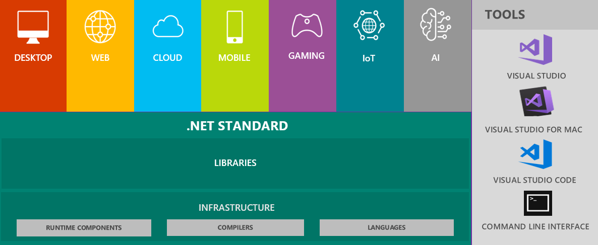

## Introduction to .NET Core

.NET Core is an open-source, general-purpose development platform maintained by Microsoft and the .NET community on GitHub. It's cross-platform (supporting Windows, macOS, and Linux) and can be used to build device, cloud, and IoT applications. 

.NET Core has the following characteristics:
- Cross-platform: Runs on Windows, macOS, and Linux operating systems.
- Consistent across architectures: Runs your code with the same behavior on multiple architectures, including x64, x86, and ARM.
- Command-line tools: Includes easy-to-use command-line tools that can be used for local development and in continuous-integration scenarios.
- Flexible deployment: Can be included in your app or installed side-by-side (user-wide or system-wide installations). Can be used with Docker containers.
- Compatible: .NET Core is compatible with .NET Framework, Xamarin, and Mono, via .NET Standard.
- Open source: The .NET Core platform is open source, using MIT and Apache 2 licenses. .NET Core is a .NET Foundation project.
- Supported by Microsoft: .NET Core is supported by Microsoft, per .NET Core Support.

NET Core Platform contains the following main parts:
- **.NET Runtime** − It provides a type system, assembly loading, a garbage collector, native interop and other basic services.
- **Fundamental Libraries** − A set of framework libraries, which provide primitive data types, app composition types and fundamental utilities.
- **SDK & Compiler** − A set of SDK tools and language compilers that enable the base developer experience, available in the .NET Core SDK.
- **‘dotnet’ app host** − It is used to launch .NET Core apps. It selects the runtime and hosts the runtime, provides an assembly loading policy and launches the app. The same host is also used to launch SDK tools in much the same way.

## Introduction to ASP.NET Core

This introduction is also done in form of PowerPoint presentation. 
It covers benefits, basics, MVC, Web API, data access and auth. 
You can create new ASP.NET Core MVC and ASP.NET Core Web API applications in parallel to check out all the mentioned features yourself. 
