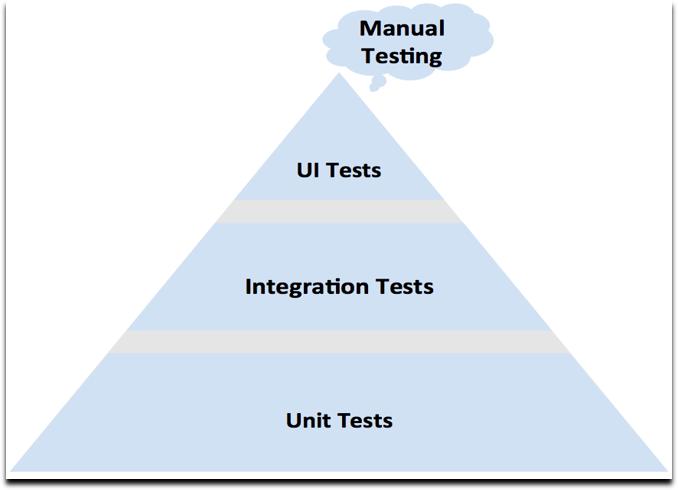
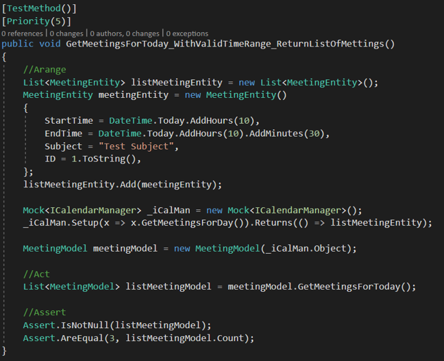
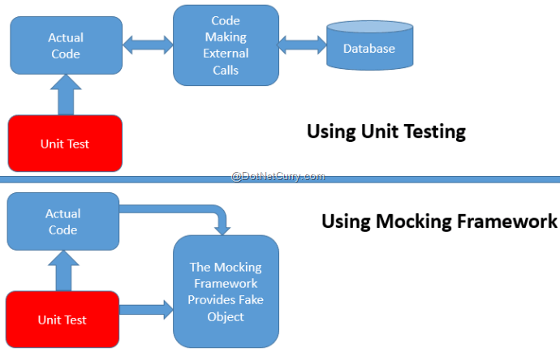

#Introduction

Software testing is defined as an activity to check whether the actual results match the expected results and to ensure that the software system is Defect free.
It involves execution of a software component or system component to evaluate one or more properties of interest.

Software testing also helps to identify errors, gaps or missing requirements in contrary to the actual requirements

## Why Testing

Testing is important because software bugs could be expensive or even dangerous. Software bugs can potentially cause monetary and human loss, and history is full of such examples.

*   In April 2015, Bloomberg terminal in London crashed due to software glitch affected more than 300,000 traders on financial markets. 
    It forced the government to postpone a 3bn pound debt sale.
*   Nissan cars have to recall over 1 million cars from the market due to software failure in the airbag sensory detectors. 
    There has been reported two accident due to this software failure.
*   Starbucks was forced to close about 60 percent of stores in the U.S and Canada due to software failure in its POS system. 
    At one point store served coffee for free as they unable to process the transaction.
*   Some of the Amazon’s third party retailers saw their product price is reduced to 1p due to a software glitch. They were left with heavy losses.
*   Vulnerability in Window 10. This bug enables users to escape from security sandboxes through a flaw in the win32k system.
*   In 2015 fighter plane F-35 fell victim to a software bug, making it unable to detect targets correctly.
*   China Airlines Airbus A300 crashed due to a software bug on April 26, 1994, killing 264 innocent live
*   In 1985, Canada's Therac-25 radiation therapy machine malfunctioned due to software bug and delivered lethal radiation doses to patients, 
    leaving 3 people dead and critically injuring 3 others.
*   In April of 1999, a software bug caused the failure of a $1.2 billion military satellite launch, the costliest accident in history
*   In may of 1996, a software bug caused the bank accounts of 823 customers of a major U.S. bank to be credited with 920 million US dollars.

## Types of tests

### UI Tests
About this part you will hear more from our colleagues from Testing departman.

### Integration Tests

#### What are Integration tests

Although each software module should be unit tested, defects still exist for various reasons like:

*   A Module, in general, is designed by an individual software developer whose understanding and programming logic may differ from other programmers.
    Integration Testing becomes necessary to verify the software modules work in unity
*   At the time of module development, there are wide chances of change in requirements by the clients. 
    These new requirements may not be unit tested and hence system integration Testing becomes necessary.
*   Interfaces of the software modules with the database could be erroneous
*   External Hardware interfaces, if any, could be erroneous
*   Inadequate exception handling could cause issues.

### Unit Tests

#### What are Unit tests
Sometimes software developers attempt to save time by doing minimal unit testing. This is a myth because skipping on unit testing leads to higher Defect fixing costs during System Testing, 
Integration Testing and even Beta Testing after the application is completed. Proper unit testing done during the development stage saves both time and money in the end.
Here, are key reasons to perform unit testing. 

*   Unit Tests fix bug early in development cycle and save costs.
*   It helps understand the developers the code base and enable them to make changes quickly
*   Good unit tests serve as project documentation
*   Unit tests help with code re-use. Migrate both your code andyour tests to your new project. Tweak the code till the tests run again.

#### Naming convention

**UnitOfWork_InitialCondition_ExpectedResult**

Here's a naming convention in three parts that I prefer to use on my projects. 
The first part of the name is the unit of work being tested. 
You can think of this part of the name as the title of your unit test that indicates the main scenario the test is covering. 
The second part of the name is the initial condition. This is how you are setting up the scenario on your test. 
This part can explain the aspect of the business logic that the test covers. It is more specific than the unit of work. 
The expected result is the last part of the test name. Here you describe what the expectation is for this unit of work and initial condition.

#### DAMP vs. DRY principle
Cutting down on duplicate code in the name of maintainability, which is the DRY principle, Don't Repeat Yourself. 
However, in testing there is the saying DAMP versus DRY with DAMP standing for Declarative And Meaningful Phrases. 
The essence of this statement is that the tests should not repeat themselves as much as possible while leaving room for the documentation aspect of testing. 
So keep in mind that while code duplication is bad, each one of your tests is an isolated chapter in your test book, and if removing a piece of logic hurts the readability,
then don't remove it. And from a maintenance perspective, you also need to make sure that you don't centralize out a piece of logic that can't be changed on its own meaning 
if the centralized code is used in two test methods, then any change will be reflected in both tests. As long as that wouldn't break either of them, then centralize away.

#### Arrange-Act-Assert pattern

#### Mocking

A mock also substitutes for a dependency, but it knows something about how that dependency should work. 
It knows what methods were called within it and how many times and in what order.
There's no reason to create a mock unless you're going to assert something about how it did its job.
If you just need a stand-in or something to return some data, then you will use a stub. 
If you need to know how a method was called or the order the methods were called, then you will use a mock.

#### Best practise
*   Consistent – Multiple runs of test should always return same value if there was no changes in code. 
*   Atomic – There can be only two results PASS or FAIL, test can’t be partially successful. Tests shouldn’t depend on other test result.
*   Single Responsibility – One test should test only one scenario. 
*   Self-descriptive – must be easy to read and understand it. 
*   No conditional logic or loops – Split in two tests rather than using if or Case. Tests should not contain While, DoWhile or For.
*   No exception handling – indicate expected with attribute. Catch only expected type of exception, others exception go uncaught, test fail if expected is not caught. 
*   Informative Assertion messages – By reading assertion message you should know why test is failing. 
*   No test logic in production code – Separate unit tests and Production code in different projects, Use Dependency injection or Mocks to isolate production code. 
    Do not create methods that are used only by tests.
*   Separation per business module – Faster execution, frequently execution.
*   Separation per type – Different purpose, time of execution.
*   Do not create too many asserts on same tests.
